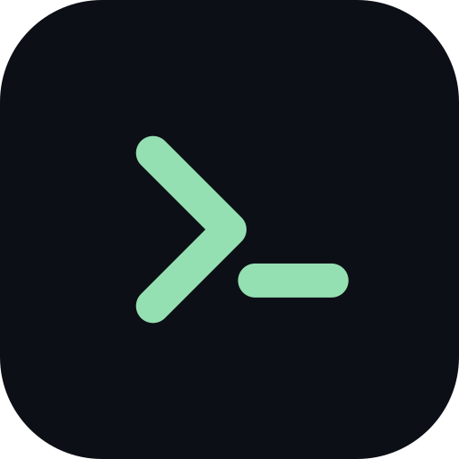
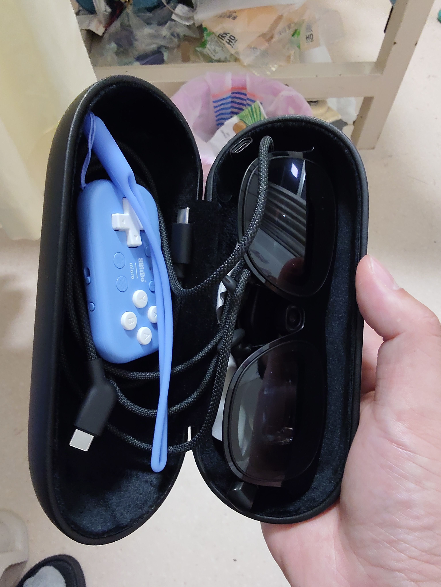
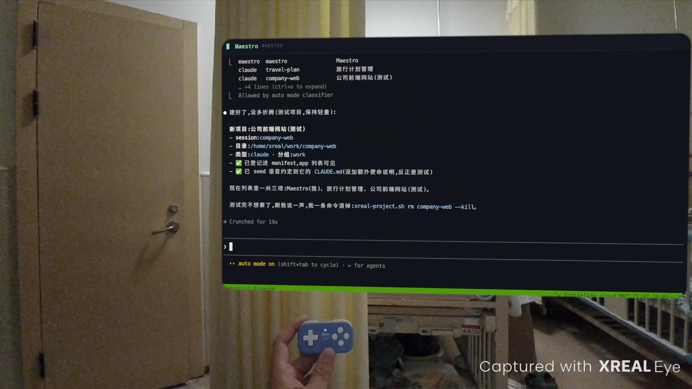
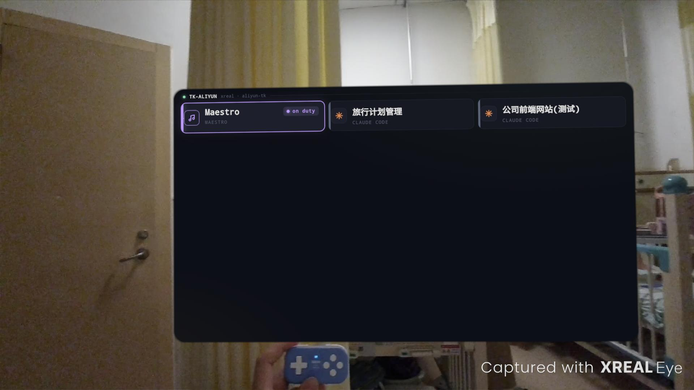
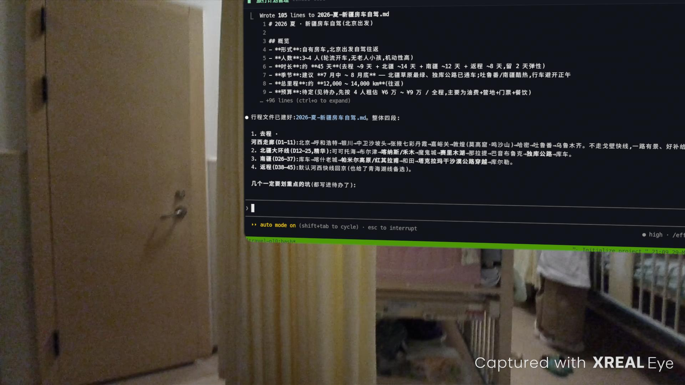
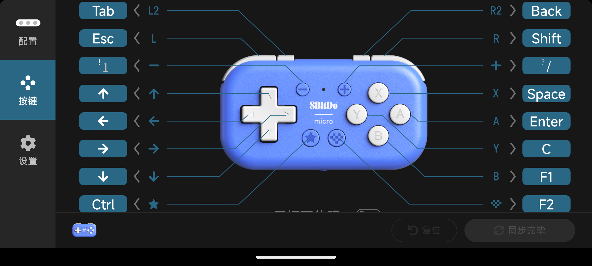

<div align="center">



# xreal-ai-client

**一套戴在脸上的远程开发终端** —— 用 AR 眼镜 + 口袋安卓主机 + 语音,在通勤路上 / 咖啡馆 / 公园里指挥一支跑在云端的 Claude Code「agent 舰队」。不用笔记本,不用鼠标,不用触摸。

[](LICENSE)    

</div>

一个 Android App 把 SSH client + 现代 terminal UI(WebView + xterm.js)+ 语音输入塞进同一个进程,跑在 **XREAL One Pro AR 眼镜 + Beam Pro** 上,连回你自己的服务器操作 Claude Code。

<div align="center">



<sub>整套「开发工位」装进一个眼镜盒 —— XREAL One Pro 眼镜 · 8BitDo Micro 手柄 · 线材</sub>

<br><br>

  

<sub><b>戴上眼镜看到的真实画面</b> —— 左:对 <b>Maestro</b> 说一句就建好项目 · 中:项目列表(一个 host 下管多个 agent) · 右:进终端看 Claude Code 干活</sub>

</div>

> **现状**:Phase 0 完成,核心流程已在 Beam Pro 真机打通 —— 项目列表 → 开 project → 真 SSH 终端(中英文 + powerline 完整显示)→ 键盘/语音输入 → 返回。「代客安装 (Valet Setup)」+ Maestro 编排 + 列表 live-fetch 均已落地、真机验证。详见 [`ROADMAP.md`](ROADMAP.md)。这是一个活跃开发中的原型,不是成品。

---

## ⌨️ 操作:6 个键 + 语音,没有鼠标和触摸

戴着眼镜,全部操作压缩到 **8BitDo Micro**(~6 键蓝牙手柄)的物理键 + 语音。用官方 [8BitDo Ultimate Software](https://app.8bitdo.com/Ultimate-Software-V2/) 把手柄配成下图(真机实测后的最终映射):



| 物理键 | 发送键码 | app 自定义语义 |
|---|---|---|
| 十字键 ↑ ↓ ← → | 方向键 | — |
| A | `Enter` | — |
| B | `F1`(131) | **按住 = 语音输入**(松手结束识别,中英自动判别) |
| 右下特殊键 | `F2`(132) | **终端 → 返回项目列表** |
| L2 / L / R | `Tab` / `Esc` / `Shift` | — |
| R2 | `Backspace` | — |
| `-` / `+` | `!` / `/` | — |

> 除 `F1`/`F2` 是 app 自定义键外,其余都是标准键盘键 —— 由终端 / Claude Code 按常规处理,无 app 特定行为。

<details>
<summary><b>为什么是 <code>F1</code>/<code>F2</code> 而不是 <code>F13</code>/<code>F14</code>?</b> — Stage A.1 真机实测的坑</summary>

最初设计用 `F13`–`F15` 这些「冷门」功能键(8BitDo 官方支持、不与打字冲突)。但 Beam Pro 真机实测发现 —— 它的 8BitDo HID 键盘走系统的 `/system/usr/keylayout/Generic.kl`,而该布局里 **`F13`–`F24`(scancode 183+)全被注释掉**,Android 映射不出 keycode,会在送达 app *之前*把键丢弃(`getevent` 能看到 `KEY_F13`,但 `dispatchKeyEvent` 收不到任何东西)。`/system` 只读、无 root 改不了。而 `F1`–`F12` 在 `Generic.kl` 里是活跃的(→ `KEYCODE_F1`=131…),8BitDo 也能稳定发出,所以改用 `F1`/`F2`(避开 `F5`/`F11`/`F12` —— WebView 可能拿去做刷新/全屏/devtools)。屏幕虚拟键盘上的 🎤 走 JSBridge 直调,和物理 `F1` 互不冲突,两种触发同时可用。
</details>

---

## 理念

**前提:在 AR 眼镜 + 6 键手柄 + 语音的交互边界上,传统"鼠标 + 触摸 + 满屏 GUI"的模型彻底失效。** 你没有舒服的键盘,没有指点设备,屏幕是投在眼前的虚拟大屏。于是这个项目押三个注:

1. **终端优先,键盘 + 语音驱动。** 终端是密度最高、最不依赖指点的人机界面。配一个现代、可读(AR 下大字号高对比)的 terminal UI,加上中英语音直写,就能在眼镜下高效操作远程 shell。

2. **由 AI agent 代办,而不是给人做 UI。** 配 SSH、生成密钥、建项目目录这些"管理动作",在眼镜+6 键上手做是地狱。所以**这个 app 刻意不做设置界面** —— 把这些活儿外包给 AI:笔记本上的 agent 经 `adb` 替你把 app 装好(**代客安装 Valet Setup**),服务器上常驻一个 agent(**Maestro**)按你的语音诉求建项目、管理列表。**你只负责动嘴,agent 干所有脏活。** 这是对"未来你靠语音指挥一群 agent、agent 自己搞定底层"的一次具体押注。

3. **零服务端增量,优雅降级。** 服务端只跑你本来就有的 SSH + tmux + Claude Code —— 不装任何自定义 daemon、网关、ttyd。聪明都在 client 端。任何一环挂了,你随时退回 Termius / Termux 继续干活,这个 app 不是必需品。

产品定位不是"又一个 SSH client",而是一个 **AI agent 集群指挥台**:层级是 `Host → 多个 Project`,主入口是项目列表 —— 同时管 ~10 个远程 agent,一眼看出哪个在干活、哪个卡住等你反馈。

---

## 硬件

整套是一副"可穿戴的无笔记本开发工位":

| 部件 | 作用 |
|---|---|
| **XREAL One Pro**(AR 眼镜) | 把一块桌面级虚拟大屏投到眼前(横屏、宽幅,接近 MacBook 16:10 的可视区),让你不用盯着手机小屏 |
| **Beam Pro**(口袋安卓主机,X4100 / Android 14 / Snapdragon) | 驱动眼镜显示 + 跑这个 App;自带方向键/按键 |
| **8BitDo Micro**(~6 键蓝牙手柄) | 主输入设备(方向键 + `Enter` + 语音键 + 返回)—— 完整键位见上方「操作」章节 |
| **海外 Ubuntu 服务器**(你自己的) | 跑 tmux + Claude Code,被 app 经原生 SSH(22 端口)连入 |

App 锁横屏、响应式布局,从第一天就按"眼镜里的宽屏 dashboard"来设计。输入只走物理键 + 语音(键位见上方「操作」章节),系统软键盘被刻意禁用(会挡半屏)。

---

## 代客安装 (Valet Setup) — 签名特色

**这个 app 你不能亲手安装,只能让 AI agent 替你装。这是设计,不是缺陷。** 由你的两位「AI 班底」伺候:

| 角色 | 在哪 | 干什么 |
|---|---|---|
| **Valet(代客)** | 你的笔记本 | 经 `adb` 完成 app 初始化:生成专用 SSH key、下发 host 配置、触发导入、部署 Maestro |
| **Maestro(指挥)** | 你的服务器 | 常驻工作根目录,按你的语音诉求建项目目录、起 tmux session、维护项目清单 manifest |

```
   ┌─ "I'll set it up myself." ──── said no user of this app, ever ─┐
   └────────────────────────────────────────────────────────────────┘

     YOU, in AR glasses:   "set it up."  ──┐   ...then sips coffee.
                                            │
                                            ▼
     VALET   (Claude Code on your laptop)
        - generates a dedicated SSH key
        - adb push  ──[ key + host config ]──►   THE APP  (the phone)
                                                    - no settings UI. it just obeys.
                                                    - imports key to private storage
                                                          │
                                                          │ ssh
                                                          ▼
     MAESTRO (Claude Code on your server)
        - mkdir / tmux / claude
        - runs your fleet, maintains the project list
        - "the ensemble is ready, maestro."

     YOU: still sipping coffee. did literally nothing. perfect.
```

**怎么用**:
1. 在笔记本上开一个 Claude Code,把 [`docs/agent-setup-guide.md`](docs/agent-setup-guide.md) 丢给它 —— 它就是你的 Valet。
2. 它问你 host 信息、生成专用 key、经 `adb` 装好 app,并把 [`docs/orchestrator-CLAUDE.md`](docs/orchestrator-CLAUDE.md) 部署成服务器上的 Maestro(配 [`docs/xreal-project.sh`](docs/xreal-project.sh) 建项目助手)。
3. 之后戴上眼镜,对 Maestro 说"帮我搞个做 X 的项目",它建目录、起 agent、更新列表;你 BACK 回列表,新项目就在那儿。

> **给帮你装的 agent**:整个 onboarding **建议全程走 `adb` 通道**,不要手动 GUI 安装、也不要在眼镜里输任何配置 —— 构建 APK(`cd android && ./gradlew assembleDebug`)→ `adb install -r app/build/outputs/apk/debug/app-debug.apk` → 再做**代客安装**(`adb push` 专用 key + host 配置到 staging,启动 app 触发导入)。host / key 的初始化也走 adb,不另设 UI。完整 runbook 见 [`docs/agent-setup-guide.md`](docs/agent-setup-guide.md)。

**安全**:每台 host 一把**专用、一次性**的 SSH key,在你笔记本上生成,经 USB(`adb`)直送 app 私有存储(`600`)。中转区里那把临时 key,由 Valet 在确认导入后 `adb shell rm` 清掉。**全程不碰你的主 key。**

---

## 架构(一句话版)

一个 APK 内闭环,服务端零增量:

```
Beam Pro 上的单个 APK
├─ WebView(xterm.js + WebGL)          ← 现代 terminal UI,大字号/高对比/中英+powerline
│    ↕ Base64 over JSBridge
├─ SSH 模块(sshj)— TCP→SSH→PTY        ← 直连云端,无中间层
├─ Voice Daemon(录音 → ASR → 直写 SSH outputStream)
└─ 列表 ⇄ 终端 的 SPA;列表从 host 的 manifest live-fetch
        │ Raw SSH (22)
        ▼
你的 Ubuntu 服务器:tmux + Claude Code(无 ttyd / 无网关 / 无自定义 daemon)
```

完整架构 + 可编译代码骨架见 [`docs/architecture.md`](docs/architecture.md)。

---

## 仓库导航

```
.
├── CLAUDE.md            ← 项目主指南(也是 Claude Code cold-start 的入口)
├── README.md            ← 本文件
├── LICENSE              ← MIT
├── ROADMAP.md           ← 分级需求跟踪(P0 核心 / P1 可用性 / P2 体验增强)
├── HANDOFF.md           ← 动态状态:当前进度 + 下一步
├── docs/
│   ├── background.md            ← 完整背景:为什么做这个 App
│   ├── architecture.md          ← 完整架构 + 代码骨架
│   ├── agent-setup-guide.md     ← 给 Valet(笔记本 agent)的安装 runbook
│   ├── orchestrator-CLAUDE.md   ← Maestro 的 CLAUDE.md(部署到 host 工作根)
│   ├── xreal-project.sh         ← Maestro 的建项目助手(按类型起环境 + 写 manifest)
│   ├── projects.example.json    ← 项目清单 manifest 示例
│   ├── session-persistence-options.md  ← tmux / abduco 等驻留方案调研
│   ├── stage-a-experiments.md   ← 物理设备到位后的验证实验 + fallback
│   ├── upstream-docs-index.md   ← 上游 term-on-demand docs 导航
│   └── images/                  ← README 用图(app icon、8BitDo 键位图、眼镜视角)
└── android/             ← Android Studio 项目(Kotlin,minSdk/targetSdk 34)
```

- **人类想了解为什么 / 怎么实现**:按 `docs/background.md` → `docs/architecture.md` → `ROADMAP.md` 的顺序读。
- **这个项目大量由 Claude Code 协作开发**:`CLAUDE.md` 是 agent 的 cold-start 入口(角色、约束、协作偏好都在那)。

---

## 开发 / 贡献

```bash
cd android && JAVA_HOME="/Applications/Android Studio.app/Contents/jbr/Contents/Home" ./gradlew assembleDebug
adb install -r app/build/outputs/apk/debug/app-debug.apk
```

> JDK 必须用 Android Studio 自带的 JBR 21(系统默认 java 8 不支持 AGP 8.x);上面命令已带上 `JAVA_HOME`。单元测试:`./gradlew test`(`VolcFrame` / `PcmChunker` / `Hotwords` 有 JVM 覆盖)。

- 本项目大量由 **Claude Code** 协作开发 —— [`CLAUDE.md`](CLAUDE.md) 是 agent 的 cold-start 入口(角色 / 约束 / 协作偏好);动手前先读它和 [`ROADMAP.md`](ROADMAP.md)。
- 欢迎 issue / PR。架构经多轮收敛(见 CLAUDE.md §5「关键约束」),改动前先对齐这些约束。

---

## 上游

本项目是 [`clawzhang89-bot/term-on-demand`](https://github.com/clawzhang89-bot/term-on-demand) "终端优先 + 按需 UI" 哲学的具体实施,设计源头是其 `docs/07-android-app-architecture.md`。索引见 [`docs/upstream-docs-index.md`](docs/upstream-docs-index.md)。

---

## License

[MIT](LICENSE) © 2026 Evan

随便用 —— 复制、修改、商用、再发布都可以,保留版权声明即可。
